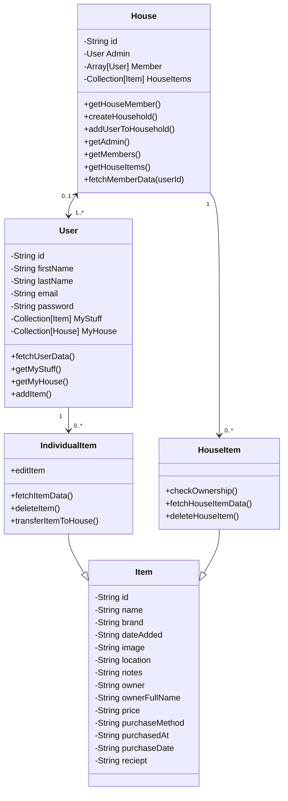
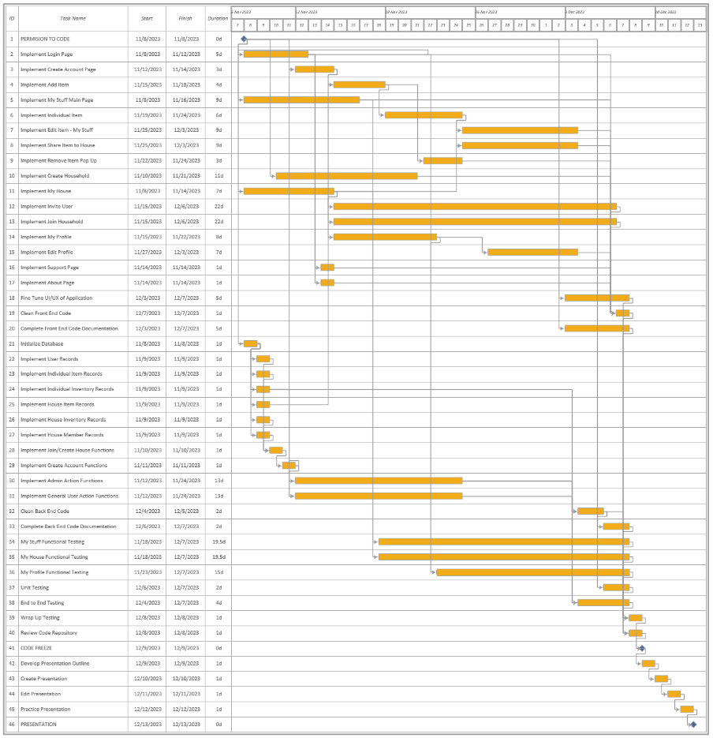

# 🏠 Shared Household Inventory App

A cross-platform mobile app built with **Flutter** and **Firebase** for managing personal and shared inventory in co-living environments.

This app helps roommates and shared households track ownership, usage, and storage of items—supporting features like item sharing, real-time sync, image-based entry, and QR-based user pairing.

This is a team final project for CS5520 at Northeastern University.

## 🚀 Tech Stack

- **Frontend**: Flutter (Dart)
- **Backend/Services**: Firebase Firestore, Firebase Authentication, Firebase Storage
- **Other Tools**: Google ML Kit (image recognition), QR Code API, GitHub Projects (project management)

## 🧩 Key Features

- **User Registration and Household Hosting**
  - Secure login and registration
  - Role-based access control: Admin/Host vs Member

- **Private Inventory ("My Stuff")**
  - Add items with descriptions, images, and purchase info
  - Filter by room/location
  - Share items to household inventory

- **Household Inventory ("My House")**
  - Shared view of contributed items from all members
  - Admin controls and owner-based item permissions
  - Real-time syncing across devices

- **QR Code-Based Onboarding**
  - Seamless user pairing to household via time-sensitive QR invites

- **ML-Based Item Entry**
  - Google ML Kit integration for photo-based item detection *(beta feature)*

- **Performance & Testing**
  - Over 75% unit test coverage on core services
  - Optimized UI for mobile responsiveness
  - Real-time updates via Firestore listeners

## 🛠 Architecture Overview

- **Modular Firebase service abstraction**
- **Firestore data modeling** based on users, households, and item ownership
- **Scoped state management** to isolate data across tabs
- **Widget reusability** and mobile-first UX design

## App Workflow Overview

The app is organized into three main segments accessible from a bottom navigation bar:

1. **My Stuff** – User's personal inventory  
 

2. **My House** – Shared household items 
 

3. **My Profile** – Account settings and user management 
  

---

## Key Wireframes  

**Login & Create Account**  
  

**My Stuff Page**

  

**Add Item Page**

  

**Edit Item Details Page**

  

**Household Creating, Paring, and Invitation Pages**

  

## UML Class Diagram  

## Gantt Chart  

Visual timeline for our team’s development cycle (Waterfall style)

  

## 🗂 Project Status

✅ Finalized core features  
🧪 In progress: improved ML integration, item export features  
🧱 Full-cycle development completed using waterfall-style planning and milestone tracking via GitHub Projects

## 👥 Team

Developed by: Andrew Moran, Jiyu He, Kabila Williams, Steve Chen  
Final project for CS5520 - Mobile App Development, Northeastern University

## 🔗 License

MIT License (or as applicable)

